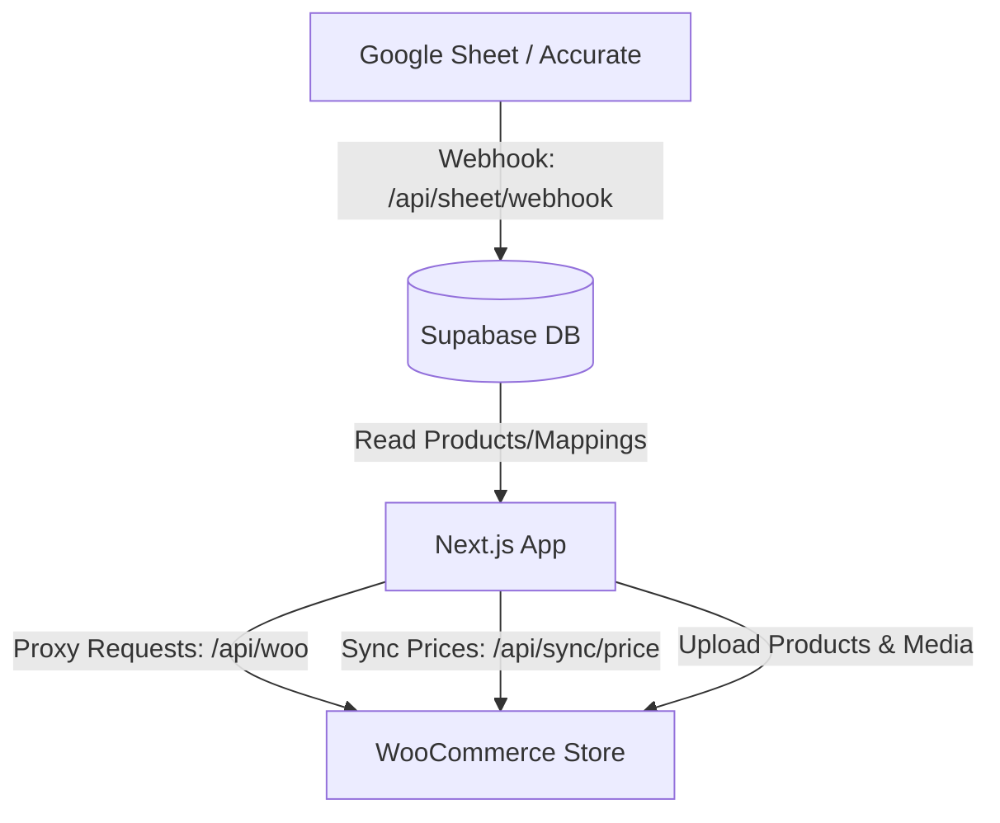

<!-- BEGIN:nextjs-agent-rules -->
# This is NOT the Next.js you know

This version has breaking changes — APIs, conventions, and file structure may all differ from your training data. Read the relevant guide in `node_modules/next/dist/docs/` before writing any code. Heed deprecation notices.

# WooCommerce & Accurate Price Sync Application

Welcome, Agent! This document explains the internal processes, architecture, database schema, and technical details of the application. Refer to this document before making any changes.

---

## 1. System Architecture

The application acts as a middleware between:
1. **Accurate ERP / Google Sheets**: The source of truth for products, stock, cost price (CP), selling price (SP/SRP), and dealer price (PRICE).
2. **Supabase Database**: Stores users, local product cache, SKU mappings, and synchronization logs.
3. **WooCommerce Store**: The e-commerce destination where prices, stock, and product catalogs are kept up to date.

---

## 2. Key Processes

### A. Product Ingestion & Caching
*   **Endpoint**: `/api/sheet/webhook` (POST)
*   **Logic**: Updates or inserts records into the `products` table in Supabase.
*   **Security**: Uses the `x-webhook-secret` header which matches `SHEET_WEBHOOK_SECRET` in `.env.local`.
*   **Field Mapping**:
    *   `Kode Accurate` (Primary Key)
    *   `NAMA BARANG` (Product Name)
    *   `KATEGORI` (Category)
    *   `NAMA BRAND` (Brand)
    *   `STATUS` (Active/Non-active state in Accurate)
    *   `CP` (Cost Price / Modal)
    *   `SP` (Selling Price / SRP / Suggested Retail Price)
    *   `PRICE` (Dealer Price)

### B. Product Matching (Mapping)
*   **Endpoint**: `/api/sync/map` (POST)
*   **UI Page**: `app/dashboard/sync/page.tsx`
*   **Process**:
    1. PIC searches for the corresponding WooCommerce product/variation in the Sync page.
    2. The `/api/woo` proxy handles search requests to WooCommerce to avoid CORS.
    3. If the selected WooCommerce product is **Variable**, the PIC is forced to select a specific **Variation**.
    4. Upon selection, a record is upserted into `product_woo_mapping` linking `kode_accurate` to `woo_product_id` and `woo_variation_id`.

### C. Price Synchronization
*   **Endpoint**: `/api/sync/price` (POST)
*   **Process**:
    1. Fetches the product from the `products` table using the `kode_accurate`.
    2. Parses the raw `SP` (Selling Price / SRP) using `parseAccuratePrice()` (removes currency symbols, dots as separators, and handles decimal commas).
    3. Fetches the active mapping from `product_woo_mapping`.
    4. Calls WooCommerce PUT endpoint to update `regular_price` of the product or specific variation.
    5. Duration and status are logged in the `sync_log` table.

### D. WooCommerce Product Creation
*   **UI Page**: `app/dashboard/upload/page.tsx`
*   **Process**:
    1. Allows creation of **Simple** or **Variable** products.
    2. Images are first uploaded via `/api/media` (which proxies to WordPress Media API) to retrieve WordPress image attachment IDs.
    3. For variable products, global attributes are loaded and used to generate combinations.
    4. Product details (name, SKU, categories, description, prices, attributes, images) are posted to WooCommerce.
    5. The newly created product is instantly cached in the session cache (`woo_pending_product`) to populate the dashboard without a full reload.

---

## 3. Database Schema

The system uses Supabase with the following main tables:

### `profiles`
Stores user identities and roles.
*   `id` (uuid, PK): Matches Supabase Auth `users.id`.
*   `email` (text)
*   `name` (text)
*   `role` (text): `admin` (sees all categories) or `pic` (restricted view).
*   `pic_category` (text): Category keyword to filter products (e.g., `komponen`, `laptop`, `aksesoris`).

### `products`
Acts as a local cache for Accurate ERP / Google Sheet products.
*   `Kode Accurate` (text, PK)
*   `NAMA BARANG` (text)
*   `STATUS` (text)
*   `CP` (text): Cost Price.
*   `SP` (text): Suggested Retail Price (SRP) synced to WooCommerce.
*   `PRICE` (text): Dealer Price.
*   `KATEGORI` (text)
*   `NAMA BRAND` (text)
*   `TANGGAL UPDATE` (text)
*   `Stok Sistem`, `NON AKTIF`, `LOKASI`, `barcode_ean`, `min_stock`, `unit`.

### `product_woo_mapping`
Links Accurate products to WooCommerce listings.
*   `id` (bigint, PK)
*   `kode_accurate` (text, FK -> `products.Kode Accurate`)
*   `woo_product_id` (bigint)
*   `woo_variation_id` (bigint, nullable)
*   `woo_sku_full` (text)
*   `woo_name` (text)
*   `is_active` (boolean)
*   `needs_review` (boolean): Flags mappings created automatically that need human review.
*   `match_method` (text): E.g., `manual`, `auto-sku`, `auto-name`.

### `sync_log`
Tracks WooCommerce synchronization attempts.
*   `id` (bigint, PK)
*   `kode_accurate` (text)
*   `woo_product_id` (bigint)
*   `action` (text): `sync_price`, `sync_stock`, etc.
*   `status` (text): `success` or `error`.
*   `message` (text)
*   `error_detail` (text)
*   `triggered_by` (uuid, FK -> `profiles.id`)
*   `duration_ms` (integer)

---

## 4. Role-based Category Filtering

The backend implements category filtering for PICs in `app/api/sync/products/route.ts`:
*   Keyword mappings are defined in `lib/supabase-server.ts` (`PIC_CATEGORY_KEYWORDS`).
*   If `pic_category` is provided, a SQL `OR` filter checks if the `KATEGORI` column matches (using `ilike` case-insensitive check):
    *   `komponen` -> `komponen`, `component`
    *   `laptop` -> `laptop`, `printer`, `laser`
    *   `aksesoris` -> `aksesoris`, `aksesori`, `accessories`, `accessory`
*   Admins bypass this filter and can view and map all products.
