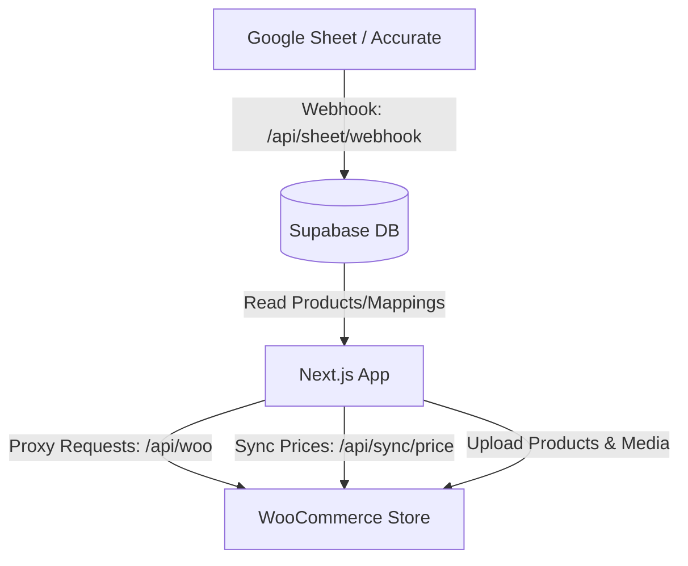

<!-- BEGIN:nextjs-agent-rules -->
# This is NOT the Next.js you know

This version has breaking changes — APIs, conventions, and file structure may all differ from your training data. Read the relevant guide in `node_modules/next/dist/docs/` before writing any code. Heed deprecation notices.

# HNS SYNC V1: WooCommerce & Accurate Price Sync

Welcome, Agent! This document explains the internal processes, architecture, database schema, and technical details of the application. Refer to this document before making any changes.

---

## 1. System Architecture

The application acts as a middleware between:
1. **Accurate ERP / Google Sheets**: The source of truth for products, stock, cost price (CP), selling price (SP/SRP), and dealer price (PRICE).
2. **Supabase Database**: Stores users, local product cache, SKU mappings, and synchronization logs.
3. **WooCommerce Store**: The e-commerce destination where prices, stock, and product catalogs are kept up to date.



---

## 2. Key Processes

### A. Product Ingestion & Caching
*   **Endpoint**: `/api/sheet/webhook` (POST)
*   **Logic**: Updates or inserts records into the `products` table in Supabase.
*   **Security**: Uses the `x-webhook-secret` header which matches `SHEET_WEBHOOK_SECRET` in `.env.local`.
*   **Field Mapping**:
    *   `Kode Accurate` (Primary Key)
    *   `NAMA BARANG` (Product Name)
    *   `KATEGORI` (Category)
    *   `NAMA BRAND` (Brand)
    *   `STATUS` (Active/Non-active state in Accurate)
    *   `CP` (Cost Price / Modal)
    *   `SP` (Selling Price / SRP / Suggested Retail Price)
    *   `PRICE` (Dealer Price)

### B. Product Matching (Mapping)
*   **Endpoint**: `/api/sync/map` (POST)
*   **UI Page**: `app/dashboard/sync/page.tsx`
*   **Process**:
    1. PIC searches for the corresponding WooCommerce product/variation in the Sync page.
    2. The `/api/woo` proxy handles search requests to WooCommerce to avoid CORS.
    3. If the selected WooCommerce product is **Variable**, the PIC is forced to select a specific **Variation**.
    4. Upon selection, a record is upserted into `product_woo_mapping` linking `kode_accurate` to `woo_product_id` and `woo_variation_id`.

### C. Price Synchronization
*   **Endpoint**: `/api/sync/price` (POST)
*   **Process**:
    1. Fetches the product from the `products` table using the `kode_accurate`.
    2. Parses the raw `SP` (Selling Price / SRP) using `parseAccuratePrice()` (removes currency symbols, dots as separators, and handles decimal commas).
    3. Fetches the active mapping from `product_woo_mapping`.
    4. Calls WooCommerce PUT endpoint to update `regular_price` of the product or specific variation.
    5. Duration and status are logged in the `sync_log` table.

### D. WooCommerce Product Creation
*   **UI Page**: `app/dashboard/upload/page.tsx`
*   **Process**:
    1. Allows creation of **Simple** or **Variable** products.
    2. Images are first uploaded via `/api/media` (which proxies to WordPress Media API) to retrieve WordPress image attachment IDs.
    3. For variable products, global attributes are loaded and used to generate combinations.
    4. Product details (name, SKU, categories, description, prices, attributes, images) are posted to WooCommerce.
    5. The newly created product is instantly cached in the session cache (`woo_pending_product`) to populate the dashboard without a full reload.

---

## 3. Database Schema

The system uses Supabase with the following main tables:

### `profiles`
Stores user identities and roles.
*   `id` (uuid, PK): Matches Supabase Auth `users.id`.
*   `email` (text)
*   `name` (text)
*   `role` (text): `admin` (sees all categories) or `pic` (restricted view).
*   `pic_category` (text): Category keyword to filter products (e.g., `komponen`, `laptop`, `aksesoris`).

### `products`
Acts as a local cache for Accurate ERP / Google Sheet products.
*   `Kode Accurate` (text, PK)
*   `NAMA BARANG` (text)
*   `STATUS` (text)
*   `CP` (text): Cost Price.
*   `SP` (text): Suggested Retail Price (SRP) synced to WooCommerce.
*   `PRICE` (text): Dealer Price.
*   `KATEGORI` (text)
*   `NAMA BRAND` (text)
*   `TANGGAL UPDATE` (text)
*   `Stok Sistem`, `NON AKTIF`, `LOKASI`, `barcode_ean`, `min_stock`, `unit`.

### `product_woo_mapping`
Links Accurate products to WooCommerce listings.
*   `id` (bigint, PK)
*   `kode_accurate` (text, FK -> `products.Kode Accurate`)
*   `woo_product_id` (bigint)
*   `woo_variation_id` (bigint, nullable)
*   `woo_sku_full` (text)
*   `woo_name` (text)
*   `is_active` (boolean)
*   `needs_review` (boolean): Flags mappings created automatically that need human review.
*   `match_method` (text): E.g., `manual`, `auto-sku`, `auto-name`.

### `sync_log`
Tracks WooCommerce synchronization attempts.
*   `id` (bigint, PK)
*   `kode_accurate` (text)
*   `woo_product_id` (bigint)
*   `action` (text): `sync_price`, `sync_stock`, etc.
*   `status` (text): `success` or `error`.
*   `message` (text)
*   `error_detail` (text)
*   `triggered_by` (uuid, FK -> `profiles.id`)
*   `duration_ms` (integer)

---

## 4. Role-based Category Filtering

The backend implements category filtering for PICs in `app/api/sync/products/route.ts`:
*   Keyword mappings are defined in `lib/supabase-server.ts` (`PIC_CATEGORY_KEYWORDS`).
*   If `pic_category` is provided, a SQL `OR` filter checks if the `KATEGORI` column matches (using `ilike` case-insensitive check):
    *   `komponen` -> `komponen`, `component`
    *   `laptop` -> `laptop`, `printer`, `laser`
    *   `aksesoris` -> `aksesoris`, `aksesori`, `accessories`, `accessory`
*   Admins bypass this filter and can view and map all products.

---

## 5. Features Summary (MVP)

1.  **Authentication & Role Management**: Supabase-based login. Two roles: `admin` (sees everything, manages users) and `pic` (limited to specific categories).
2.  **Dashboard & Product Management**:
    *   View all WooCommerce products.
    *   **Inline Editing**: Instantly edit Price, SKU, and Stock status without page reloads.
    *   **Status Control**: Publish or Private products with a single click.
    *   **Delete Product**: Delete products with a custom confirmation modal.
3.  **Advanced Product Upload**:
    *   Upload Simple or Variable products.
    *   Generate variations automatically based on attributes.
    *   Upload images directly via WordPress Media API.
    *   Rich text editor (Tiptap) for product descriptions.
4.  **Accurate ERP / Sheets Sync**:
    *   Webhook endpoint (`/api/sheet/webhook`) to receive stock/price updates.
    *   Manual mapping interface to link ERP SKUs with WooCommerce Product IDs.
5.  **Activity Logs & Backup**:
    *   Records every action (update price, toggle stock, upload product).
    *   **Google Sheets Backup**: Export logs directly to an existing Google Sheet using the Google Sheets API.

---

## 6. Installation & Setup Guide

1.  **Clone & Install Dependencies**
    ```bash
    npm install
    ```
2.  **Environment Variables**
    Create a `.env.local` file and populate it with:
    *   `NEXT_PUBLIC_APP_URL`
    *   WooCommerce API (`WOO_URL`, `WOO_CONSUMER_KEY`, `WOO_CONSUMER_SECRET`)
    *   WordPress API for media (`WP_URL`, `WP_USERNAME`, `WP_APP_PASSWORD`)
    *   Supabase (`NEXT_PUBLIC_SUPABASE_URL`, `NEXT_PUBLIC_SUPABASE_ANON_KEY`, `SUPABASE_SERVICE_ROLE_KEY`)
    *   Google Drive / Sheets API (`GOOGLE_CLIENT_EMAIL`, `GOOGLE_PRIVATE_KEY`)
3.  **Supabase Setup**
    *   Run the SQL migrations to create the required tables: `profiles`, `products`, `product_woo_mapping`, `sync_log`, and `activity_logs`.
    *   Enable Email/Password authentication.
4.  **Create Admin User**
    Run the setup script to create the initial admin user using the Supabase Service Role key:
    ```bash
    node scratch/activate-admin.mjs
    ```
5.  **Run Development Server**
    ```bash
    npm run dev
    ```

---

## 7. HNS SYNC V2 (Planned Features)

**Visi V2: Pusat Analisa Pergerakan Stok Produk (Stock Movement Analysis)**

Berdasarkan diskusi terbaru, arah pengembangan sistem V2 akan difokuskan murni untuk **Analisa Internal**, bukan untuk mengupdate stok ke WooCommerce ataupun Purchasing dalam waktu dekat.

**Latar Belakang & Kendala:**
- **WooCommerce Stok:** Dikelola manual oleh Admin WordPress (Sistem ini tidak boleh menyentuh stok Woo agar barang tidak terlihat sedikit oleh pelanggan).
- **Accurate ERP:** Stok sebenarnya ada di Accurate, namun API Accurate tidak diizinkan untuk diakses secara langsung oleh manajemen/bos.
- **Solusi:** Google Sheets hasil cek fisik (Opname) dari 3 lokasi akan menjadi satu-satunya *sumber kebenaran (source of truth)* bagi sistem internal ini.

**Logika & Fitur Sistem V2:**
1. **Sumber Data:** 3 File Google Sheets terpisah (Gudang Utama, Nagoyahill, Gateway).
2. **Kunci Pencocokan:** Tab `REKAPAN`, menggunakan kolom `KODE BARANG`.
3. **Nilai Stok Fisik:** Diambil dari kolom `# TOTAL` di ujung kanan.
4. **Sentralisasi & Rekam Jejak (History):** 
   - Sistem menarik data dari ketiga sheet dan menyimpannya di database (Supabase).
   - Sistem akan melacak angka ini dari waktu ke waktu (misalnya ditarik setiap hari).
5. **Analisa Pergerakan Produk (Core Feature):** 
   - Karena website tidak terhubung ke API Penjualan/Kasir untuk melihat "barang keluar", website akan menyimpulkan barang keluar berdasarkan penurunan stok di Sheets.
   - Contoh: Kemarin total stok 3, hari ini total stok 2. Sistem mencatat ada pergerakan/penjualan sebanyak 1 unit.
   - **Tujuan Akhir:** Membuat Dashboard Analitik yang menampilkan **"Produk Fast-Moving"** (stoknya cepat berkurang) dan **"Produk Slow-Moving"** (stoknya diam berhari-hari). Ini akan sangat membantu manajemen dalam mengambil keputusan bisnis.
